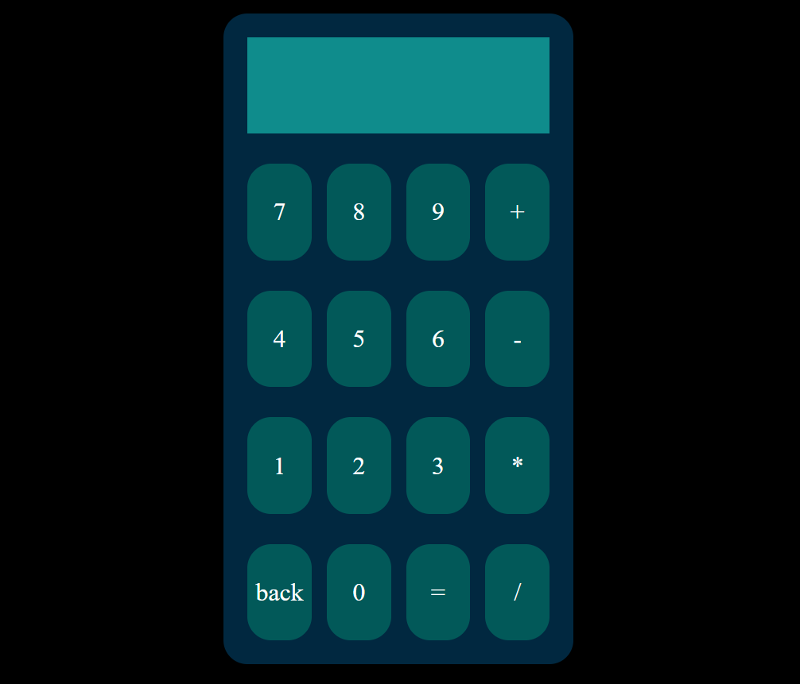

# Basic-Calculator
A simple and responsive calculator web application built using **HTML, CSS, and JavaScript**.  
This project performs basic arithmetic operations (addition, subtraction, multiplication, division) and demonstrates clean UI design and interactive DOM manipulation.

**Live Demo:** [View on GitHub Pages](https://zen-yee.github.io/Basic-Calculator/)

## Features
- Supports addition, subtraction, multiplication, and division  
- Clear and Reset buttons for easy input control  
- Responsive layout for desktop and mobile  
- Keyboard input support (optional enhancement)  

## Built With
- **HTML5** – Structure of the calculator interface  
- **CSS3** – Styling and layout (responsive design)  
- **JavaScript (ES6)** – Core calculator logic and DOM event handling

## Preview

  
## Author
👤 **Zen**
- Portfolio: [View My Portfolio](https://zen-yee.github.io/Zen_Portfolio/)
- LinkedIn: [https://linkedin.com/in/zen](https://www.linkedin.com/in/qian-hui-yee-66a394205/)
